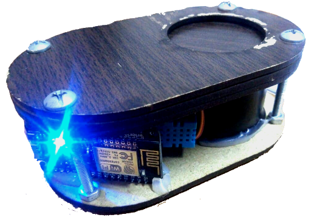
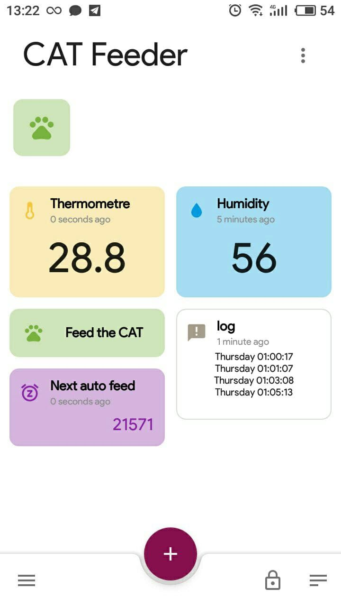

# CAT Feeder

## Schematic

  
[PDF File](doc/cat_feeder-v2.pdf)

## Video

  
[doc/photo_2021-07-07_13-32-09.jpg](video_2021-07-07_14-10-44.mp4)

## reference

- [PlatformIO](https://docs.platformio.org/en/latest/platforms/espressif8266.html)
- [OTA from **Jan Penninkhof**](https://www.youtube.com/watch?v=lXchL3hpDO4&list=LL&index=5)
- [last minute engineers](https://lastminuteengineers.com/esp8266-nodemcu-arduino-tutorial/)
- [Include same Lib from esp8266/Arduino](https://github.com/esp8266/Arduino) (Servo motor)
- [mqtt browker with **flespi.io**](https://flespi.io/#/)
- [Mqtt Dashboard - IoT for android](https://play.google.com/store/apps/details?id=com.app.vetru.mqttdashboard&hl=en&gl=US)
