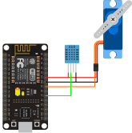
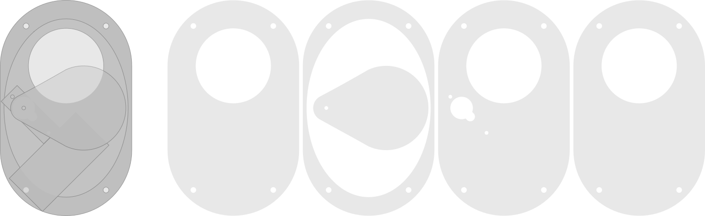
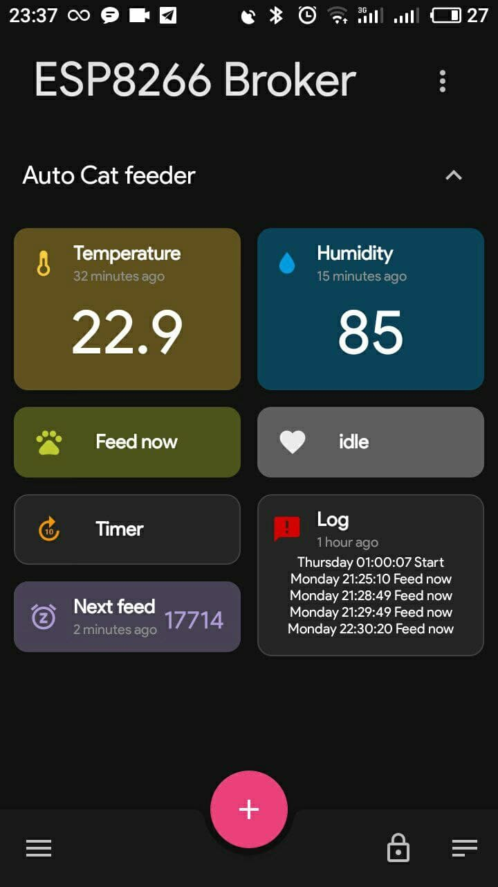

# CAT Feeder


Today I am building an ESP8266 based automatic cat feeder that can automatically feed my cat on a regular basis. 

In this circuit, we use a:
- ESP8266 Controle module (NodeMCU).
- Servo motor (SG90) is used to deliver and controle the contitier of food.
- DHT11 to get the temperature and humidity of envirenment.
- The internet to set the feed time automatically, monitor and controle manually the system remotley.

The ESP8266 module is connect to mqtt broker and ntp server.

## Circuit Diagram

  


## Feeder Model

[](doc/cat_feeder-v3.svg)
  
[File PDF](doc/cat_feeder-v2.pdf)

## Video

[](https://youtu.be/edkQ1ui7OJM)


## Settings

WiFi settings
```cpp
 9 // WiFi settings
10 const char* ssid = "open_wifi";
11 const char* password = "12345678";
12 /* Put IP Address details */
13 IPAddress local_ip(192, 168, 254, 253);
14 IPAddress gateway(192, 168, 254, 254);
15 IPAddress subnet(255, 255, 255, 0);
```

```cpp
19 // MQTT Broker
20 #include <PubSubClient.h>
21 const char* mqtt_broker = "broker.mqtt.com";
22 const char* mqtt_username = "";
23 const char* mqtt_password = "";
24 const int mqtt_port = 1883;
   ...
28 #define mqtt_topic(topic) ((String) "qfd564dsf654qsdf/" + topic).c_str()
```

```cpp
30 // NTP server
   ...
33 NTPClient timeClient(ntpUDP, "time.google.com", 3600);
   ...
35 int default_cycle = 21600;  // 21600 Feed every 6 Hour
```

## reference

- [PlatformIO](https://docs.platformio.org/en/latest/platforms/espressif8266.html)
- [OTA from **Jan Penninkhof**](https://www.youtube.com/watch?v=lXchL3hpDO4&list=LL&index=5)
- [last minute engineers](https://lastminuteengineers.com/esp8266-nodemcu-arduino-tutorial/)
- [Include same Lib from esp8266/Arduino](https://github.com/esp8266/Arduino) (Servo motor)
- [mqtt browker with **flespi.io**](https://flespi.io/#/)
- [Mqtt Dashboard - IoT for android](https://play.google.com/store/apps/details?id=com.app.vetru.mqttdashboard&hl=en&gl=US)
