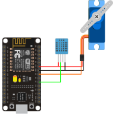

# CAT Feeder

Today I am building an ESP8266 based automatic cat feeder that can automatically feed my cat on a regular basis. 

In this circuit, we use a:
- ESP8266 Controle module (NodeMCU).
- Servo motor (SG90) is used to deliver and controle the contitier of food.
- DHT11 to get the temperature and humidity of envirenment.
- The internet to set the feed time automatically, monitor and controle manually the system remotley.

The ESP8266 module is connect to mqtt broker and ntp server.

## Circuit Diagram

  

## Feeder Model

  
[File PDF](doc/cat_feeder-v2.pdf)

## Video

## reference

- [PlatformIO](https://docs.platformio.org/en/latest/platforms/espressif8266.html)
- [OTA from **Jan Penninkhof**](https://www.youtube.com/watch?v=lXchL3hpDO4&list=LL&index=5)
- [last minute engineers](https://lastminuteengineers.com/esp8266-nodemcu-arduino-tutorial/)
- [Include same Lib from esp8266/Arduino](https://github.com/esp8266/Arduino) (Servo motor)
- [mqtt browker with **flespi.io**](https://flespi.io/#/)
- [Mqtt Dashboard - IoT for android](https://play.google.com/store/apps/details?id=com.app.vetru.mqttdashboard&hl=en&gl=US)
